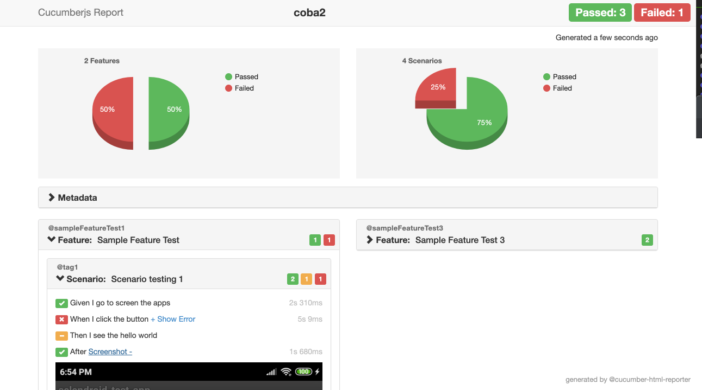

# Automation Testing on Android apps
Automation testing on android apps using appium, wd, and cucumberjs.

## Requirement
- android sdk
- setup enviroment variable (on mac ~/.bash_profile)
- setup enviroment variable: java_home, android_home
- appium desktop version 1.10.0
- emulator or device

## Installation
```
go to the directory this project

- npm install

or

- yarn install
```

## Env
```
cp env.sample .env
```

```
PLATFORM_NAME=android
PLATFORM_VERSION=8.1.0
DEVICE_NAME=31ebd123456
APP=selendroid-test-app.apk
PACKAGE=io.selendroid.testapp
HOST=localhost
PORT=4723
```

## Checking device already connected on laptop
- adb devices

## Run Appium Server
- Go to Appium desktop
- Start Server

## Checking enviroment ($JAVA_HOME, $ANDROID_HOME) on laptop
- appium-doctor

## Inspect element tools
1. Uiautomatorviewer

```
~/Library/Android/sdk/tools/bin/uiautomatorviewer
```

2. Appium inspector

- Go to Appium desktop
- Start Server
- Start Inspector Session
- Create Desired capabilities and Start Session

Desired capabilities

```
{
  "platformName": "android",
  "platformVersion": "8.1.0",
  "deviceName": "31ebd123456",
  "noReset": "True",
  "appPackage": "io.appium.android.apis",
  "appActivity": "io.appium.android.apis.ApiDemos",
  "automationName": "Appium",
  "app": "/Users/APK/ApiDemos-debug.apk"
}
```

## How to Run
```
npm run cucumberjs -- --tags @tag3
npm run cucumberjs -- --tags 'not @skip'
npm run cucumberjs -- --tags '@tag1 or @tag3'
npm run cucumberjs -- --tags 'not @tag1 and (@tag2 or @tag3)'
```
https://github.com/cucumber/cucumber/tree/master/tag-expressions

## Structure
    .
    ...
    features/test           # Test directory (alternatively `features` or `test`)
    ├── reports             # Report files
    ├── step_definitions    # Step definition files
    ├── support             # Support files
    │   ├── activity        # Activity list
    │   ├── data            # Data test
    │   ├── objects         # Page object files
    │   └── hook            # Hook files (before - after test)
    └── sample.feature      # Test files using feature format (cucumber)
    ...

## Apps
`apps/selendroid-test-app.apk`

## Helpers
- `helpers/capabilities.js`

## Reporter
- Cucumber html report
- `helpers/cucumber_reports.js`

```
npm run cucumber-reports
```


## Catatan
- `await driver.setImplicitWaitTimeout(5000);` atau time sleep tidak bekerja maksimal.
- Kendala tidak bisa import `And` dari module cucumber `const { And } = require('cucumber');`
- Belum ada sample untuk input `data example` di file.feature.
- CICD-jenkins masih perlu explore bagaimana install appium di server dan setup emulator, kemudian membuat jobs di jenkins untuk running project ini.
